# Adversarial Machine Learning : Compte rendu des attaques de plusieurs classifieurs entrainés sur du trafic réseau

## Notre équipe

| Noms             | Mail @epita.fr   | Pseudo GitHub |
|------------------|------------------|---------------|
| Adrien MERAT     | adrien.merat     | Timelessprod  |
| Corentin DUCHÊNE | corentin.duchene | Nigiva        |
| Henri JAMET      | henri.jamet      | hjamet        |

## But

Ce projet de recherche vise à : 
* entraîner un modèle à détecter les attaques à partir d'un flux de requêtes du réseau
* tenter de tromper ce même modèle en utilisant des techniques dit d'*adversarial machine learning*.

Nous allons donc proposer différents benchmarks qui permettront de comparer l'entrainement de plusieurs modèles et les différentes attaques associées à ces mêmes modèles.

## Choix de la dataset
Pour ce projet, nous avions le choix entre 2 datasets :
1. UGR'16 : https://nesg.ugr.es/nesg-ugr16/
2. MAWI : https://mawi.wide.ad.jp/mawi/

UGR'16 est construit avec du trafic réseau réel ou synthétique parfois annoté comme étant une attaque ou non. Certaines des attaques sont réelles, d'autres ont été créées de toute pièce pour enrichir le jeu de données. Ces données proviennent de plusieurs collecteurs de type "netflow v9" situés dans le réseau d'un ISP espagnol. Toutes ces données ont été recueillies en 2016. 
L'avantage certain de ce jeu de données par rapport à d'autres comme MAWI demeure la prise en compte de l'évolution à long terme et la périodicité du trafic. Ainsi, on peut extraire comme feature si l'attaque a été faite le jour ou la nuit, en semaine ou le week-end. La donnée proposée dans URG'16 est déjà structurée en CSV et labellisée pour chaque requête.

MAWI est un dépot de données regroupant le trafic maintenu par le groupe de travail MAWI au sein du projet WIDE. Le trafic réseau est collecté à partir de différents points d'échantillonnage. Cette dataset s'étent de 1999 à aujourd'hui. Le jeu de données est actualisé chaque jour avec les données du jour précédent.
Pour être plus exact, les traces de trafic sont faites avec `tcpdump`. Les IP sont anonymisées. Le résultat de cette opération est un fichier de plusieurs Go par jour et par point d'échantillonnage sans label indiquant si le réseau subit une attaque ou non. C'est parfait pour faire de la détection d'anomalie. MAXILab est une base de données qui aide les chercheurs à récupérer les labels d'attaque pour chaque flux réseau. L'outil utilise des graphes pour détecter les anomalies dans le trafic.

Nous avons donc décidé d'utiliser **UGR'16** pour les raisons suivantes :
* **UGR'16** propose déjà une donnée structurée et lisible par nos outils d'analyse (fichiers CSV) contrairement à **MAWI** qui ne donne que le résultat du trafic réseau brut. La conséquence de ça, c'est qu'avec **MAWI** nous devont convertir de gros fichiers de flux réseau pour en extraire des données sous forme d'un CSV
* **UGR'16** propose déjà une donnée labélisée. Pour utiliser **MAWI** dans le cadre d'un apprentissage supervisé, nous devons nécessairement passer par le logiciel **MAWILab** et prédire les labels associés au trafic.
* **UGR'16** est bien moins volumineux que **MAWI**. **MAWI** propose le traffic réseau pour différents points de capture et cela chaque jour. 

La somme de tous ces arguments permet de conclure que **MAWI** rend la tâche de pré-traitement de la donnée beaucoup plus longue et compliquée qu'avec **UGR'16**.

# 1. Préparation du jeu de données

[UGR'16](https://nesg.ugr.es/nesg-ugr16/index.php#CAL) est une dataset découpée en :
* 17 jeux de données de "CALIBRATION" de plusieurs dizaines de Go
* 6 jeux de données de "TEST" de plusieurs dizaines de Go

En tout, il y a 181 Go de fichiers compressés pour CALIBRATION et 55 Go de fichiers compressés pour TEST.

Notre première tâche va être de :
* rééquilibre la dataset
* extraire un sous-ensemble d'exemple en se limitant à un fichier exporté de 2 Go. Cela permet ainsi un traitement plus facile de la dataset sur une machine personnelle limitée par la puissance de calcul et la taille de la mémoire vive. Nous avons estimé qu'il n'était pas nécessaire d'utiliser les 250 Go en entier pour entraîner des modèles de Machines Learning ayant un nombre de paramètres entrainables beaucoup plus faible par rapport à la masse de données disponibles.

Cette tâche a été découpée en 3 parties :
* A. Compter le nombre d'exemples par label (`background`, `blacklist`, ...)
* B. Tirer à l'aléatoirement la liste des index des exemples à extraire
* C. Extraire les exemples dont l'index a été tiré aléatoirement.

Enfin, dans une dernière phase de pré-traitement, nous sommes censés normaliser les données. La normalisation des données est un point essentiel dans l'analyse et l'utilisation de la donnée pour entrainer des modèles de Machine Learning. Dans la partie (D.) nous détaillerons le pré-traitement effectué sur la dataset extraite : cela comprend aussi bien l'encodage de certaines variables que la normalisation à 1 et la standardisation (pour avoir des variables centrées et réduites). Notons toutefois que certains modèles comme les arbres de décision n'ont pas besoin de cette étape de Normalisation/Standardisation. Par abus de langage, on parlera souvent dans cette analyse de la "Normalisation" comme étant l'étape encodant, normalisant et standardisant les données avant leur utilisation concrète.

Pour nous aider dans ce problème de Big Data, nous avons utilisé un cluster de 9 machines appartenant à l'équipe ESLR (Epita Speech & Language Recognition) du LSE de l'EPITA dont font partie deux membres du groupe (Corentin DUCHÊNE & Henri JAMET).

Nous avons utilisé Sun Grid Engine comme job scheduler. Il est beaucoup utilisé en interne pour lancer plusieurs entrainements sur différent GPU. Le temps de calcul cumulé pour les différentes tâches sur le cluster a été de 12 heures.

## A. Compter le nombre d'exemples par label
Nous avons extrait du site https://nesg.ugr.es/nesg-ugr16/ l'ensemble des URL permettant de télécharger les différentes parties de la dataset UGR'16. On a aussi bien pris les jeux de "CALIBRATION" que les jeux de "TEST".

On a écrit un script shell qui :
  * télécharge la dataset pour un mois et une semaine donnée
  * lancer un script python sur cette dataset
  * exporter le résultat de ce script sur une partition NFS du cluster
  * effacer la dataset une fois que l'ensemble des commandes ont été exécutées

En outre, on a écrit le script Python qui a permis avec un `collection.Counter` de compter le nombre d'exemples par label de la dernière colonne (`target`). Pour chaque exemple, on a vérifié que la ligne était au format `csv` et que la ligne était composée de 13 colonnes. Dans le cas contraire, la ligne est comptée comme `<INVALID_LENGTH>`.

On a obtenu le résultat suivant :

:warning: On utilise une échelle logarithmique en ordonnée.

| Target | Nombre |
| -------- | -----------:|
| `<INVALID_LENGTH>` | 44 |
| `anomaly-udpscan` | 989 872 |
| `scan11` | 1 002 679 |
| `nerisbotnet` | 1 681 529 |
| `scan44` | 4 521 175 |
| `dos` | 9 256 105 |
| `blacklist` | 98 364 053 |
| `anomaly-spam` | 101 461 876 |
| `anomaly-sshscan` | 105 277 510 |
| `background` | 16 690 732 133 |

**TOTAL :** 17 013 286 976

On remarque 2 choses :
* Certains labels comme `background` (avec 16 690 732 133 occurrences pour CALIBRATION et TEST cumulés) sont surreprésentés par rapport à d'autres comme `anomaly-udpscan` (avec 989 872 occurrences). **`background` représente 98.1% des exemples dans la dataset.**
* Certains labels ne sont présents (parfois en majorité) que certaines semaines de certains mois. Par exemple, `anomaly-sshscan` n'est présent qu'en grande quantité que dans `april.week2` et `april.week3`. Les labels issus d'attaques synthétiques comme `dos`, `scan44`, `scan11` et `nerisbotnet` ne sont présents que sur 3 semaines `august.week1`, `july.week5` et `august.week2`.

## B. Tirer à l'aléatoirement la liste des index des exemples à extraire
On part du principe qu'on essaie de garder le plus de label possible pour construire notre dataset ré-équilibrée.

On a 3 types de labels :
* Le label qui montre les lignes ignorées ou invalides `<INVALID_LENGTH>`. C'est un label créé par nos soins et qui n'est pas du tout présent dans la dataset originale.
* Le label qui représente une activité normal `background`. Donc c'est le label nommé parfois "negatif".
* Les labels qui catégorisent une requête comme une attaque en précisant le type : `anomaly-udpscan`, `scan11`, `nerisbotnet`, `scan44`, `dos`, `blacklist`, `anomaly-spam` et `anomaly-sshscan`. Ces labels sont nommés parfois "positifs".

On va ignorer les `<INVALID_LENGTH>`.
On souhaite avoir autant d'exemples négatifs que d'exemples positifs. On veut aussi que tous les types de labels positifs soient représentés dans les mêmes proportions.
Le nombre de labels de `anomaly-udpscan` est notre contrainte. On ne peut pas se permettre de prendre pour chaque label positif 1 000 000 d'exemples si certains labels ne peuvent pas donner plus de 989 872 exemples. Pour rester sur nombre rond et faciliter la détection de problème, on va prendre les proportions suivantes :
* **900 000** exemples par label **positif** : `anomaly-udpscan`, `scan11`, `nerisbotnet`, `scan44`, `dos`, `blacklist`, `anomaly-spam` et `anomaly-sshscan`. Donc en tout, on a 8 * 900 000 = **7 200 000 exemples positifs**.
* **7 200 000** exemples **négatifs** correspondant au label `background`.

On obtient en tout **144 000 000 exemples** dans notre dataset ré-équilibrée. Le poids de cette dataset en pratique atteint 1.5Go.

Pour éviter tout biais de sélection, on a tiré au sort tous ces exemples.
On effectue plusieurs tirages aléatoires sans remise pour chaque type de label jusqu'à obtenir le nombre d'exemples désiré par label.

## C. Extraire les exemples
Une fois les exemples extrait, on obtient une dataset de 1.5 Go que l'on nomme `ugr16-large.csv`. On y a ajouté un header au fichier CSV pour avoir le nom des colonnes (ce n'était pas le cas dans la dataset originale).

On va construire à partir de cette dataset extraite et rééquilibrée deux datasets plus petites : `ugr16-base.csv` et `ugr16-small.csv`. Ça permet de travailler plus facilement, rapidement tout en évitant de charger 1.5 Go de données en RAM si cela fait trop.

On met à disposition pour toute l'équipe les 3 datasets suivantes :
* `ugr16-large.csv` : **1.5 Go** dont 900 000 exemples positifs par attaque et 8 * 900 000 pour `background`.
* `ugr16-base.csv` : **147.4 Mo** dont 90 000 exemples positifs par attaque et 8 * 90 000 pour `background`.
* `ugr16-small.csv` : **14.6 Mo** dont 9 000 exemples positifs par attaque et 8 * 9 000 pour `background`.

Accès aux datasets extraites de UGR'16 : https://epitafr-my.sharepoint.com/:f:/r/personal/corentin_duchene_epita_fr/Documents/%C3%89cole/Projets/MLSECU/Dataset?csf=1&web=1&e=0WFYF1

:warning: `ugr16-base` et `ugr16-small` sont des sous-ensembles de `ugr16-large`. Ils ne servent pas de jeu de test. Pour créer un jeu de test, il faut au préalable séparer le jeu inital ( `ugr16-large`, `ugr16-base` ou `ugr16-small`) en deux jeux de données (train/test).

**Pour le reste de cette étude, on travaillera avec `ugr16-small` sauf mention contraire.**

## D. Encodage, normalisation et standardisation de la donnée

Voici les variables disponibles dans la dataset extraite :
| Nom dans notre dataset | Abréviations | Description |
| ---------------------- | ------------ | ----------- |
| `datetime_end` | `te` | Date and time of the end of a flow |
| `duration` | `td` | Duration of the flow  |
| `source_ip` | `sa` | Source IP Address |
| `destination_ip` | `da` | Destination IP Address |
| `source_port` | `sp` | Source Port |
| `destination_port` | `dp` | Destination Port |
| `protocol` | `pr` | Protocol |
| `flag` | `flg` | Flag |
| `forwarding` | `fwd` | Forwarding status  |
| `type` | `stos` | Type of Service (ToS) byte |
| `packet` | `pkt` | Packets exchanged |
| `byte` | `byt` | Bytes exchanged |
| `label` | `lb` | Label |

On distingue plusieurs types de variables :
* qualitative : `protocol`, `flag`, `label`
* quantitative : `datetime_end`, `duration`, `source_ip`, `destination_ip`, `source_port`, `destination_port`, `forwarding`, `type`, `packet`, `byte`

Certaines variables sont considérés ci-dessus comme quantitative comme `datatime_end` et les IP, mais en l'état, nous les considérons plus comme des objets devant être transformés avant de dire qu'elles le sont vraiment.

Sur les variables quantitatives, on observe les statistiques suivantes :
|-|duration  |sp|dp|fwd|type      |packet    |byte         |
|------|----------|-----------|----------------|----------|----------|----------|-------------|
|mean  |3.44      |22894.88   |18223.06        |0.00      |9.82      |20.53     |17156.97     |
|std   |27.82     |23743.02   |22813.83        |0.00      |21.42     |3416.20   |4.80e+6   |
|min   |0.00      |0.00       |0.00            |0.00      |0.00      |1.00      |27.00        |
|25%   |0.00      |80.00      |80.00           |0.00      |0.00      |1.00      |69.00        |
|50%   |0.00      |8600.00    |5010.00         |0.00      |0.00      |2.00      |196.00       |
|75%   |1.04      |47199.00   |41605.25        |0.00      |0.00      |6.00      |683.00       |
|max   |2691.89   |65535.00   |65535.00        |0.00      |252.00    |1.81e+6|2.65e+9|

On voit des échelles de valeurs complétements différentes d'une variable à une autre.
Certaines valeurs sont bornées par définition comme :
* `source_port` par 65 535
* `destination_port` par 65 535

Pour ces variables, on décide de procéder à une normalisation dit MinMax. Ainsi, on a juste à diviser la variable par 65 535.

Les autres variables ne sont pas bornées et peuvent par conséquent prendre toutes les valeurs réelles ou réelles positives.
Pour ces variables, nous décidons de standardiser la valeur, c'est-à-dire soustraire la moyenne et diviser par l'écart-type.
On calculera cette moyenne et cet écart-type sur un sous-ensemble que l'on considéra comme le jeu d'entrainement & validation, le complémentaire de ce sous-ensemble demeure le jeu de test. On s'attache à n'utiliser le jeu de test que pour évaluer les performances de nos modèles et des attaques à la fin.

On procède donc à une séparation aléatoire et "stratifiée" du jeu extrait plutôt. Dit autrement, chaque classe est présente le même nombre de fois dans chacun des jeux. On prend 90% du jeu pour le Train/Validation et 10% pour le jeu de Test. Au sein du jeu Train/Validation, on sépare de la même manière en 90% pour le Train et 10% pour la Validation.

Les adresses IP sont au format IPv4. On décide ainsi de couper les différentes parties séparées par un point. Et chaque Octet de l'IP est divisé par 255 pour obtenir une valeur entre 0 et 1. Pour les champs `protocol` et `label`, on utilise du One Hot Encoding pour les représenter au mieux et éviter une relation d'ordre entre les valeurs des catégories.

Enfin pour `flag`, on créé un vecteur de dimension 6. Pour chaque colonne, si une lettre comme "U", "A", "P", "R", "S" ou "F" est présente, on valorise la colonne à 1, sinon on garde 0 comme valeur par défaut (dans le cas du "."). De ce fait, `".AP.SF"` deviendra `[0,1,1,0,1,1]`.

Pour terminer cette partie, on va se concentrer sur la transformation de `datetime_end`.
Durant toute cette étude, nous avons essayé d'extraire les données de manière homogène sur toute la période de capture pour avoir un large éventail de valeurs et ainsi éviter un biais de sélection. On peut le voir grâce au graphique suivant :

On remarque encore une fois que la sur-représentation (et le déséquilibre temporel, voire l'inexistence) de certains labels à certains moments de l'année nous oblige à prendre beaucoup d'exemples sur une même période. Notons toutefois que `background` a bien été récupé de façon homogène toute l'année.

Afin de garder la dimension temporelle, on a fait le choix de créer un variable `day_progress` qui vaut `0` à 00h00 et à `1` à 23h59 du même jour. On peut intuitivement se dire que certaines attaques se font la nuit, moment de la journée, où les équipes de travail sont moins vigilantes et donc plus vulnérables.

In fine, après la phase de featuring et de normalisation de la dataset, les jeux de données ont gagné 20% en poids sur le disque dur. Ainsi, `ugr16-large.csv` est passé d'environ 1.4 Go à 1.7 Go.

# 2. Entraînement des classifieurs

Dans cette partie, nous allons détailler l'entrainement de nos modèles.
Avec autant de données, nous pouvions facilement faire du Deep Learning. Cependant, avec la connaissance que nous avons aujourd'hui sur les problèmes de détection de trafic anormal sur le réseau, nous savons que ce type d'apprentissage (et donc de modèle) sont loin d'être aussi performant que d'autres modèles de Machine Learning comme les arbres de décisions ou XGBoost. Il a alors été décidé de se limiter ici à de "petits" modèles de Machine Learning. C'est probablement ce genre de modèles qui a le plus de chance d'être utilisé en pratique. Le Deep Learning crée d'autres problèmes surtout à l'entrainement qui ne sont pas pertinents pour ce genre de classification. Ça nous permet de ce fait de nous concentrer sur le package `scikit-learn` et `xgboost`. En choisissant de faire du Machine Learning (et non du Deep Learning), on se retrouve avec beaucoup trop de données pour peu de paramètres à entraîner. Normalement, c'est plutôt l'inverse. Par souci de rapidité et aussi parce que ça ne change pratiquement rien (on le verra plus loin dans ce rapport), nous nous limitons à utiliser la plus petite dataset extraite `ugr16-small`.

Nous allons utiliser toutes les colonnes de la dataset normalisé comme entrée du modèle et nous allons prédire un vecteur de dimension 9 (8 attaques + `background`).

Pour établir quel algorithme est le plus adapté à la détection d'attaque sur le trafic, nous allons réaliser un benchmark. In fine, nous ne garderons que les 3 meilleurs pour essayer de les attaquer dans la seconde partie de cette étude.

Nous avons donc entrainé les modèles suivant :
* `AdaBoost` sur `Decision Tree` avec `n_estimators=100` et `learning_rate=1`
* `XGBoostoost` avec `n_estimators=500`, `max_depth=10`, `learning_rate=0.01` et `early_stopping_rounds=20`
* `Decision Tree` avec `max_depth=25`
* `Random Forest` avec `max_depth=10`
* `SVC` (SVM) avec les valeurs par défaut.
* `Logistic Regression` avec `max_iter=1000`
* `SGD` avec les valeurs par défaut.
* `Naive Bayes` avec les valeurs par défaut.

Si les valeurs ne sont pas précisées, ce sont les valeurs par défaut de `scikit-learn` qui ont été utilisées pour l'entrainement.
Les valeurs des hyper-paramètres ont été trouvées pour optimiser les performances sur le jeu de validation. Le benchmark se fait quant à lui sur le jeu de test (comme le reste).

Le résultat de ce benchmark (triés par Accuracy et par durée d'entrainement) :
|Nom                   |Acc.|F1   |AUROC|Prec.|Recall|Durée Train|Durée Test|
|----------------------|--------|-----|-----|---------|------|-----------|----------|
|AdaBoost    |0.996   |0.996|0.996|0.996    |0.996 |87.092     |1.680     |
|XGBoostoost         |0.995   |0.995|0.995|0.995    |0.995 |538.895    |1.758     |
|Decision Tree |0.990   |0.990|0.996|0.990    |0.990 |1.410      |1.194     |
|Random Forest|0.959   |0.959|0.959|0.959    |0.959 |11.910     |1.350     |
|SVC                   |0.923   |0.923|0.933|0.923    |0.923 |172.101    |29.105    |
|Logistic Regression    |0.846   |0.846|0.887|0.846    |0.846 |77.610     |1.195     |
|SGD         |0.816   |0.816|0.853|0.816    |0.816 |2.193      |1.317     |
|Naive Bayes            |0.386   |0.386|0.800|0.386    |0.386 |0.193      |1.184     |

*Acc. : Accuracy

**Prec. : Precision

Les durées sont exprimées en secondes.

On observe que les 4 premiers modèles (les plus performants selon nos critères) sont des arbres de décisions. On se permet d'utiliser l'Accuracy comme métrique de décision comme nous avons rééquilibré chaque classe positive (par rapport à la classe négative).

On peut aussi visualiser les résultats de cette manière :

On observes que `AdaBoost` sur `DecisionTree` améliore de peu les performances de `DecisionTree`. `AdaBoost` vient ajouter 80 secondes au temps d'entrainement pour 0.005 d'Accuracy. 

Regardons plus en détail les erreurs de prédictions pour chacun des modèles en affichant leur matrice de confusion :

| | |
| :-: | :-: |
| 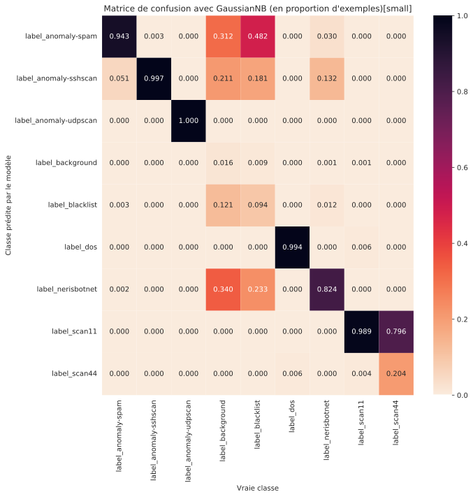 | 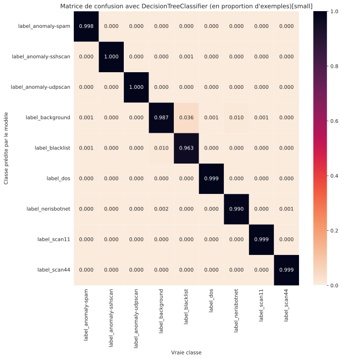 | 
| 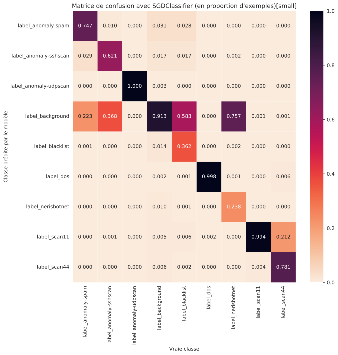 | 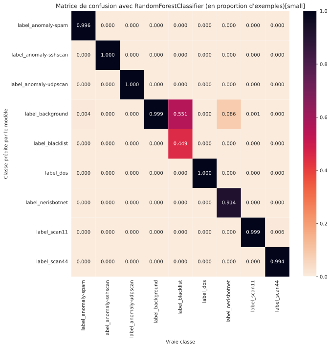 |
| 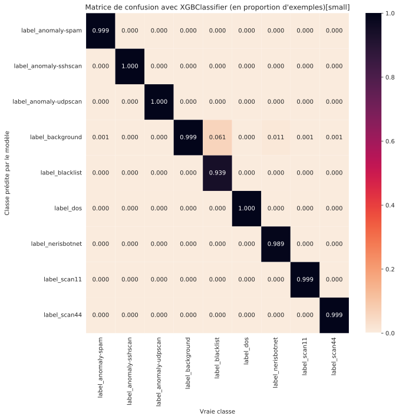 | 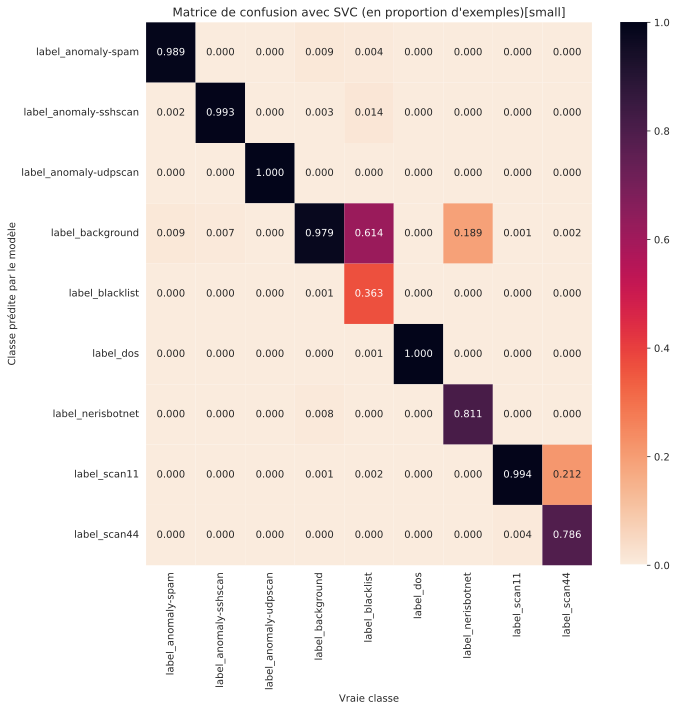 |
|  |  |

On remarque que les 4 premiers modèles du classement font assez peu d'erreurs même si la classe `blacklist` a tendance à être confondu avec `background`. Mais ça n'est pas forcément très grave, si c'est dans la `blacklist`, c'est sans doute que la requête est filtrée sur le réseau automatiquement. Le plus important, c'est d'avoir une diagonale élevée qui montrent que tous les types d'attaques et `background` sont catégorisées correctement par nos modèles.

Pour les modèles les moins performants comme `Naive Bayes` ou `SGD`, on pourrait se dire qu'il suffit d'augmenter le nombre de données pour avoir de meilleures performances. 

Regardons les matrices de confusion de pire modèle entrainé sur `ugr16-base` :
| | | |
| :-: | :-: | :-: |
| 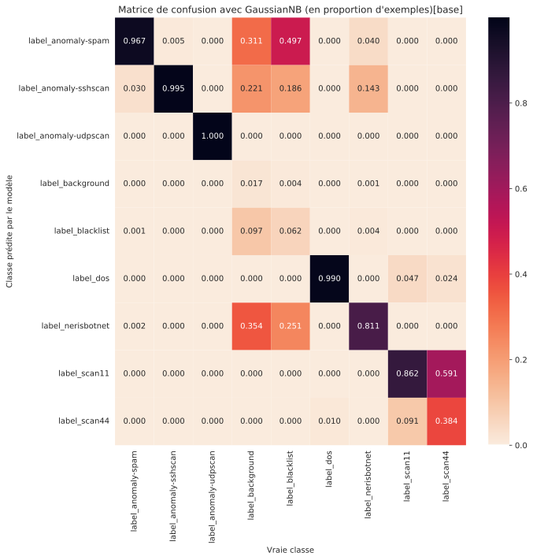 | 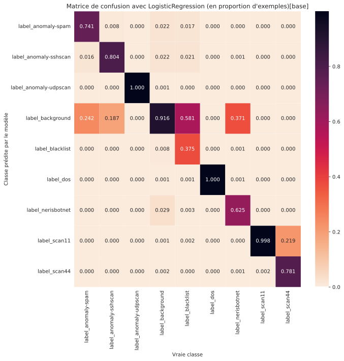 | 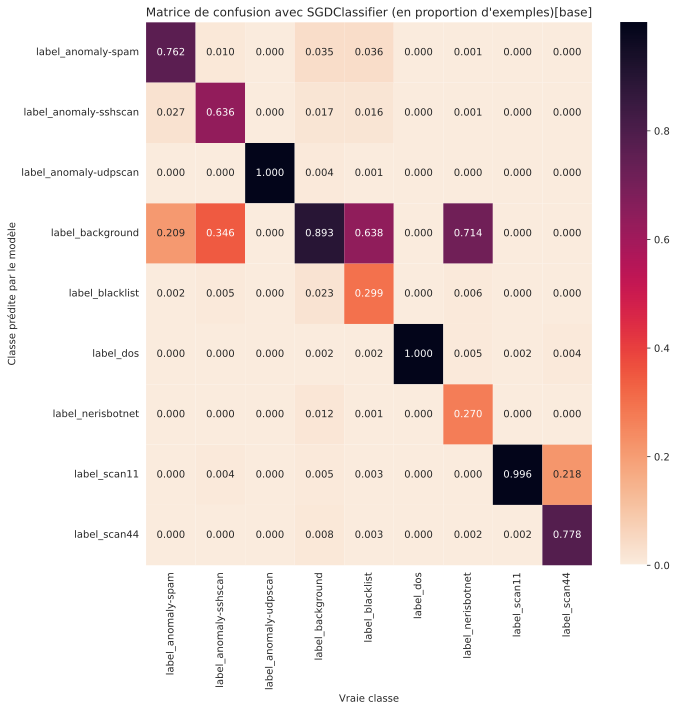 |

En pratique, on observe que ça n'améliore pas significativement les performances de ces modèles. Il n'est donc pas intéressant d'utiliser dans ce cas précis `ugr16-base` ou `ugr16-large` (même si elles apportent une plus grande diversité d'exemples).

Pour la suite, on ne garde donc que les modèles suivant :
* XGBoostoost
* Decision Tree
* Random Forest

# 3. Attaques des classifieurs

Les 3 modèles choisis pour le reste de cette étude ont des performances extrêmement similaires. Ça se joue au 3e chiffres après la virgule pour certaines métriques.

Dans cette partie, on va essayer d'attaquer les modèles en ajoutant un bruit adapté à certaines variables de l'input pour faire prédire au modèle qu'une attaque est une requête `background`. On va peut-être réussir à départager ces 3 modèles.

Nous utiliserons dans cette partie le package `art` Adversarial Machine Learning Library. Elle nous fournit (contrairement à `foolbox`) un large choix d'attaque qui fonctionne sur `scikit-learn` comme `xgboostoost`. `foolbox` propose plus des attaques à destinations des réseaux de neurones. Néanmoins, `art` met en avant les mêmes attaques pour les réseaux de neurones.

Déjà, il faut préciser que les 3 modèles sont des arbres de décisions. Aucun de ces modèles ne sont sensibles à attaque sur le "Gradient". Or, la plupart des attaques mis à disposition dans `art` se basent sur le gradient. Ça limite grandement le nombre de possibilités.

Pour les attaques restantes, certaines pulvérisent le nombre de bits au cours des itérations et provoque un dépassement de la taille de la variable (limité pour ces attaques à du `np.float32`).

Il nous reste donc les attaques suivantes :
* `DecisionTreeAttack` qui n'attaque que `DecisionTree` de `sklearn` et tirée du papier de [Papernot et al. (2016)](https://arxiv.org/abs/1605.07277)
* `HopSkipJump` tirée du papier de [Jianbo et al. (2019)](https://arxiv.org/abs/1904.02144)
* `ZooAttack` tirée du papier de [Pin-Yu Chen et al. (2018)](https://arxiv.org/abs/1708.03999)

Pour mesurer les performances de nos attaques et parce que chaque attaque ciblée peut mettre du temps à produire un résultat, on a décidé de créer un sous-ensemble du jeu de Test contenant 10 exemples pour chaque attaque (donc 80 exemples en tout). Ces exemples ont été tirés aléatoirement.

On génère pour chaque attaque avec chaque modèle et chaque exemple un input adversaire presque identique à l'input donné (avec une différence MSE epsilon `eps` entre les deux) mais qui prédit `background` lorsqu'il est donné au modèle au lieu du label cible attendu.

Regardons les résultats :

|Modèle            |Attaque|Acc.|F1|Durée Attaque|eps  |
|----------------------|-----------|--------------|--------|---------------|-----|
|Decision Tree|Hop Skip Jump|0.0           |0.0     |13.679         |0.0  |
|XGBoost         |Hop Skip Jump|0.0           |0.0     |176.009        |0.0  |
|Random Forest|Hop Skip Jump|0.0           |0.0     |519.928        |0.0  |
|Decision Tree|Decision Tree Attack|0.0           |0.0     |0.112          |0.014|
|Random Forest|Zoo Attack  |0.338         |0.338   |20.666         |0.0  |
|XGBoost         |Zoo Attack  |0.438         |0.438   |11.975         |0.0  |
|Decision Tree|ZooA ttack  |0.875         |0.875   |0.761          |0.0  |

Un `eps`à `0.0` indique que la valeur est inférieure à 1e-3.
On observe d'excellente de très bon résultat avec `Hop Skip Jump` et `Decision Tree Attack`. Les attaques sont peut-être un peu longues pour `Hop Skip Jump` mais, l'ajout à l'input est tellement faible que ça compense.

Maintenant, analysons ça plus en détail en nous focalisant sur les matrices de confusion de ces attaques :

| | |
| :-: | :-: |
| 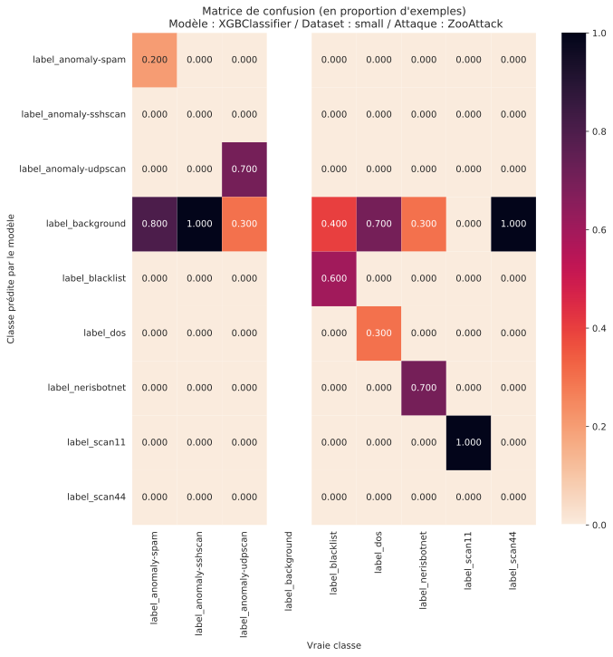 | 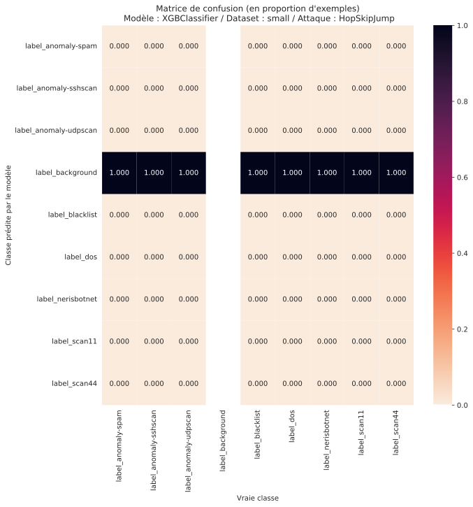 |
|  |  |
|  | 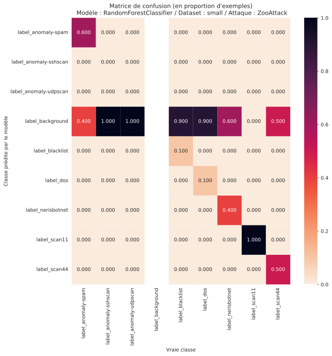 |
|  | |

Sans grande surprise, l'Accuracy traduit bien cette tendance en montrant que `Hop Skip Jump` et `Decision Tree Attack` sont très efficaces (à première vue).

Si l'on se focalise sur `Decision Tree Attack` pour `Decision Tree`, on voit que le modèle modifie sur l'ensemble du jeu de Test, les variables suivantes :
* `source_port`
* `destination_port`
* `type`
* `byte`
* `flag_A`
* `flag_S`
* `source_ip_0`
* `source_ip_1`
* `source_ip_2`
* `source_ip_3`
* `destination_ip_0`
* `destination_ip_1`
* `destination_ip_2`
* `destination_ip_3`

Ainsi, la simple modification de l'IP source, de l'IP de destination, des flags A et S, du type et de la taille de la requête, du port source et de destination permettent de faire varier la décision vers le label `background`. Ce sont ces variables que l'attaquant va essayer de varier pour attaquer sa cible sans se faire repérer. Et visiblement, toutes ces variables sont assez simples à faire évoluer.

Sauf que la plupart de ces variables obéissent à des contraintes de définition. Une adresse IPv4 contient 4 octets représentés sous la forme d'un entier variant de 0 à 255. De ce fait, si l'attaque consiste à ajouter `0.1` à un des octets de l'IP, alors l'IP n'a pas vraiment de sens. De même pour toutes les autres variables comme `source_port`, `flag_A`, ...

Pour avoir les performances authentiques des attaques, il faut respecter ces contraintes. On propose ci-après de remesurer la qualité des attaques en ayant corrigé chacun des champs ayant une contrainte sur ses valeurs. Pour connaître plus en détail les algorithmes utilisés et comprendre les variables modifiées par les attaques, on vous renvoie vers le notebook associé disponible sur le [Google Colab](https://colab.research.google.com/drive/1a_IHIxyy8BE3-ZQ0ysGsauUFjISc4tIJ?usp=sharing). 

On mesure à nouveau les performances et on obtient ce tableau (les lignes ont ecore étaient triées de la meilleure attaque à la pire) :

|Modèle            |Attaque       |Acc.|F1|Durée Attaque|eps  |
|----------------------|------------------|--------------|--------|---------------|-----|
|Random Forest|Hop Skip Jump       |0.1           |0.1     |519.928        |0.0  |
|Decision Tree|Decision Tree Attack|0.125         |0.125   |0.112          |0.014|
|Decision Tree|HopSkipJump       |0.2           |0.2     |13.679         |0.0  |
|XGBoost         |HopSkipJump       |0.312         |0.312   |176.009        |0.0  |
|Random Forest|Zoo Attack         |0.338         |0.338   |20.666         |0.0  |
|XGBoost         |Zoo Attack         |0.438         |0.438   |11.975         |0.0  |
|Decision Tree|Zoo Attack         |0.85          |0.85    |0.761          |0.0  |

Cette fois-ci, notre Accuracy n'est plus de 0. Certains exemples ont réussi à être détectés comme étant une attaque. Néanmoins `Hop Skip Jump` reste en haut du classement, suivi de `Decision Tree Attack`. On constate que `XGBoost` est beaucoup moins sensible aux attaques, une fois la correction effectuées et que ça en fait par conséquent un modèle un peu plus sûr par rapport aux autres. En fait, si l'on veut faire des généralités, XGBoost (et aussi dans une moindre mesure Random Forest) sont considérés comme des modèles boîtes noires. Cela s'explique notamment par l'utilisation de technique de Bagging/Boosting qui rend l'explicabilité des résultats plus difficile. Mécaniquement, ça rend aussi l'attaque de ces modèles plus compliqués comme on peut difficilement faire du reverse engineering déçu comparé aux Decision Tree. A contrario, les Decision Tree sont par définitions très intuitives : chaque choix est guidé par une condition et donc arriver dans un état peut s'expliquer facilement par une suite de conditions logiques.

Essayons de comprendre les classes n'ayant pas réussi à être classées comme `background` après l'attaque :

| | |
| :-: | :-: |
| 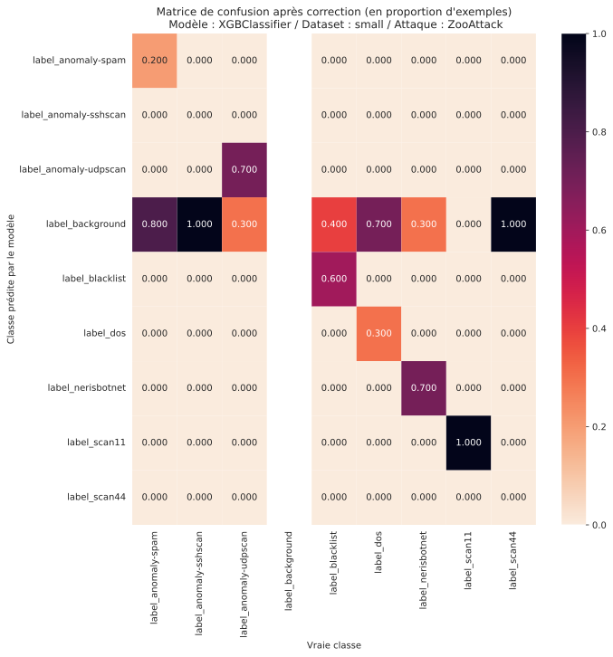 | 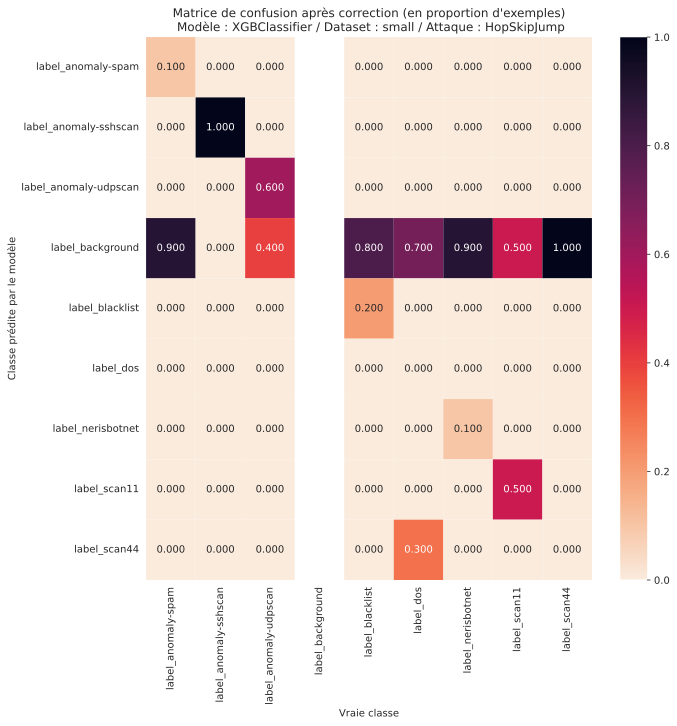 |
|  | 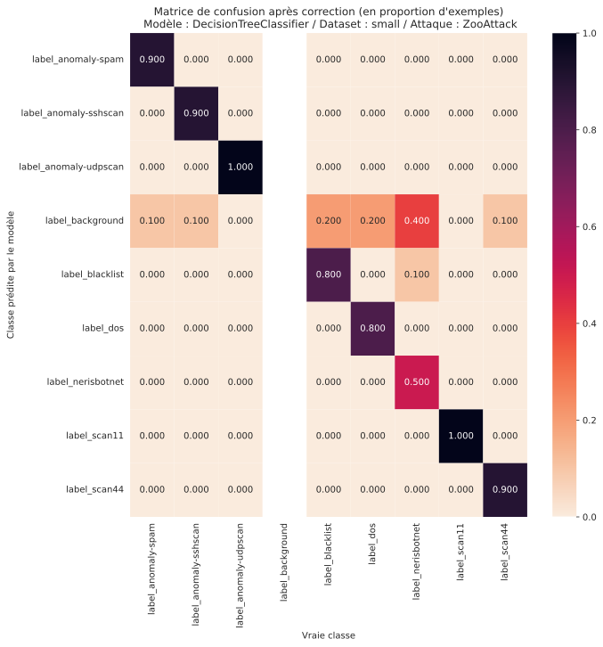 |
| 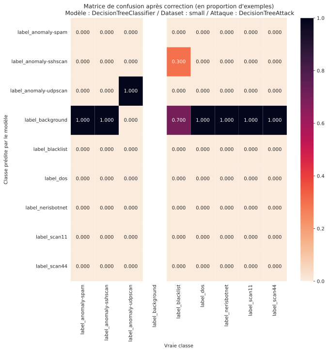 | 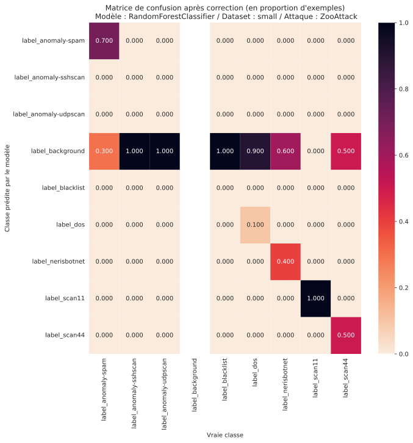 |
| 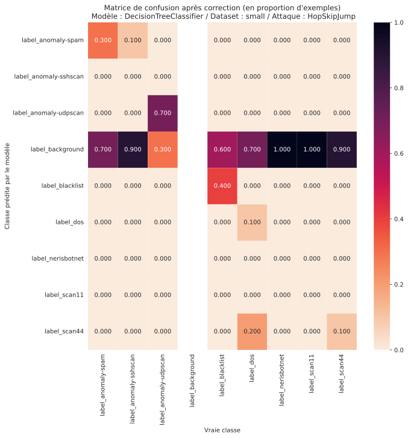 | |

Pour faciliter la comparaison, nous avons gardé l'ordre des graphiques du tableau précédent. On observe alors bien des pertes de performances significatives après cette correction. C'est d'autant plus marquant qu'il n'y a plus de ligne droite nette montrant une prédiction peu importe la vraie classe pour `background`. Toutefois, on peut dire que, globalement, les meilleures attaques arrivent à atteindre leur objectif. On est bien souvent à 80% d'exemples prédits comme `background` pour les attaques `Hop Skip Jump` et `Decision Tree Attack`.

# Conclusion

Dans cette étude, nous avons détaillé la chaîne de traitement d'un très gros volume de données. Nous avons réussi à rééquilibrer la dataset et à en extraire les exemples les plus pertinents. En outre, nous avons réussi transformer cette même donnée pour valoriser plusieurs features servant à entrainer des modèles d'apprentissage machine. 

Nous avons fait un benchmark des modèles de Machine Learning et nous en avons conclu que seuls des modèles à base d'arbres de décision permettaient d'atteindre les meilleures performances sur ce problème avec ce jeu de données. En particulier, nous nous sommes attachés dans une dernière partie à tester des attaques sur les 3 meilleurs modèles : `Decision Tree`, `Random Forest` et `XGBoost`.

Puisque ces modèles ne sont pas compatibles avec la plupart des attaques Adversarial se basant sur le gradient, on s'est retrouvé avec un corpus limité de méthodes : `DecisionTreeAttack`,  `HopSkipJump` et `ZooAttack`. Les arbres de décision sont finalement de bon modèle, car il existe peu d'attaques possibles. On a remarqué que combiné à une méthode de Bagging/Boosting, les deux meilleures attaques `DecisionTreeAttack` et  `HopSkipJump` se retrouvait un peu plus en difficulté par rapport autres modèles et aux autres attaques. En effet, l'explicabilité des prédictions de ce genre de modèle sont souvent difficiles tant les méthodes de Bagging/Boosting ont tendance à "offusquer" la raison de la décision des modèles.

Néanmoins, ce genre de classifieur n'en reste pas moins très sensible et nous avons réussi en modifiant peu de variables à tromper le modèle. En fin de compte, il suffit de très peu de modification sur l'IP source et de destination, le port source et de destination, la taille de la requête et la modification de quelques flag pour tromper nos modèles. Ce n'est pas inaccessible et ça rend très dangereux ce type d'attaque. 

Critiquons tout de même l'approche : jusqu'ici, nous avions à notre disposition, un accès complet aux modèles et paramètres entrainés du modèle. En pratique, ce sont des informations qui ne sont pas accessibles pour l'attaquant. Pour la grande majorité des attaques, il faut réaliser un nombre important d'inférence, ce qui peut attirer l'attention. Nous proposons donc une réponse mitigée à la faisabilité de ce genre d'attaque, surtout si le modèle de détection n'est pas accessible à l'attaquant.